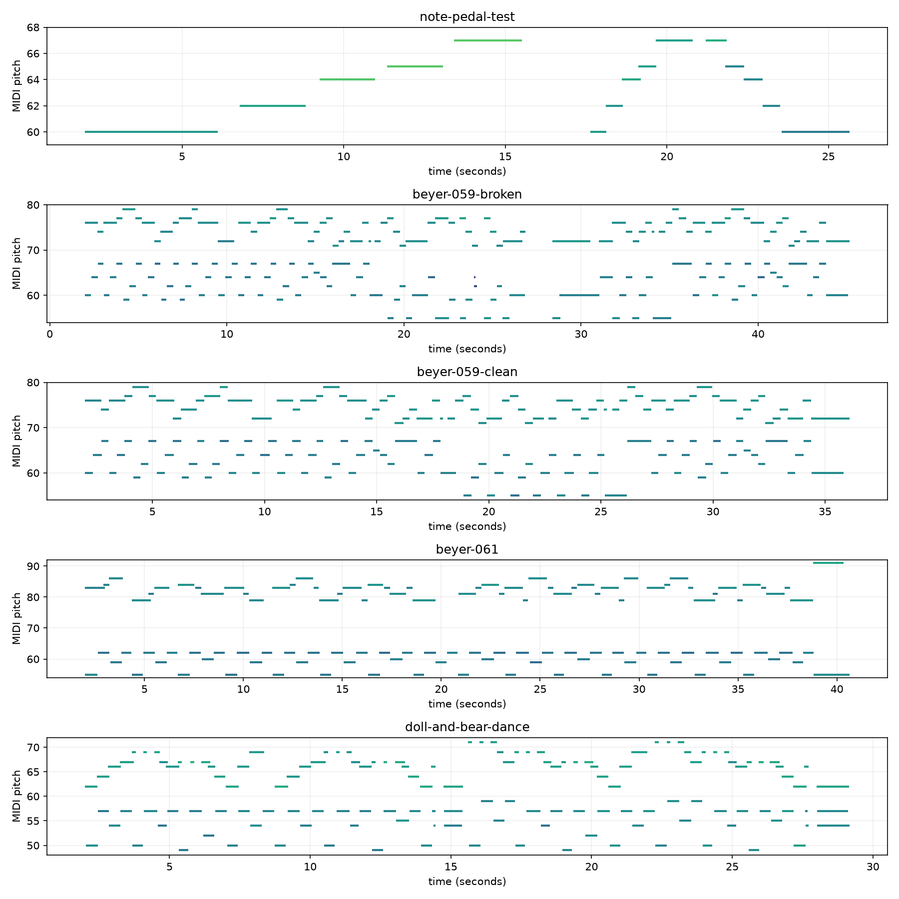
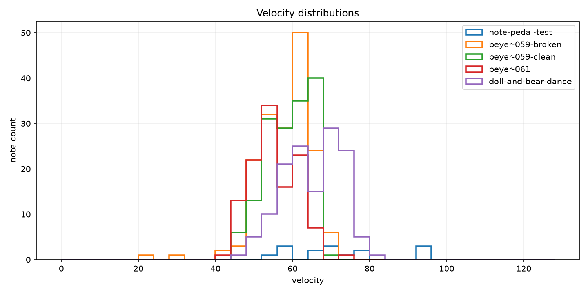

# CLP-835 MIDI 样本分析

本报告由 `analyze_midi.py` 对 `data/manifest.json` 中五份自录 MIDI 生成。曲目名称和
版本说明来自演奏者标注，不是程序根据音符序列猜测得到的。统计快照日期为
2026-09-01，疑似长停顿阈值为相邻 Note On 起点间隔严格大于 1.0 秒。

## 复现命令

```bash
uv run python learning/02-midi-analysis/analyze_midi.py \
  --manifest learning/02-midi-analysis/data/manifest.json

uv run python learning/02-midi-analysis/analyze_midi.py \
  --manifest learning/02-midi-analysis/data/manifest.json \
  --figures-dir learning/02-midi-analysis/figures
```

五个文件都是 SMF format 0、单轨、每四分音符 1920 tick，所有音符事件均使用
channel 0。每个文件都包含两个 tempo meta event，且没有未配对的 Note On。

## 时间基准与 tempo 事件

五个文件的时间头和起始 tempo 结构完全相同：

```text
ticks_per_quarter = 1920

tick 0：
    time signature = 4/4
    tempo = 500000 μs/四分音符 = 120 BPM

tick 7680：
    time signature = 6/4
    tempo = 895545 μs/四分音符 ≈ 66.998 BPM
    第一批 Note On 开始
```

因此真正的演奏事件从约 67 BPM 的 tempo 事件生效处开始。但这个数值只是文件的
tempo map，不应未经验证就解释为演奏者实际遵循的速度。

拜厄 61 左手每个相邻音是一个四分音符。对 63 个左手起音及 62 个相邻间隔的实测为：

```text
平均间隔 = 0.594 秒   → 四分音符约 101 BPM
中位间隔 = 0.590 秒   → 四分音符约 102 BPM
平均 tick 间隔 = 1273.4 ticks
文件名义四分音符 = 1920 ticks
```

所以这次演奏的中心速度明显不是四分音符 67 BPM。CLP-835 使用当前 tempo 把真实时间
映射为 tick；即使演奏没有落在名义网格上，使用相同 tempo map 回放仍能还原事件间隔。
后续做节拍或乐谱量化时，需要重新估计 beat，不能直接采用文件中的 Set Tempo。

## 汇总

| 样本 | 文件时长/s | 演奏跨度/s | 音符数 | 音域 | 力度 mean ± std `[min,max]` | 平均按键/s | CC64 down/up | 最大起音间隔/s | `>1s` 数量 |
|---|---:|---:|---:|---|---|---:|---:|---:|---:|
| 五音与踏板测试 | 32.567 | 23.653 | 15 | C4–G4 | 72.07 ± 12.62 `[52,94]` | 1.296 | 11/14 | 4.781 | 6 |
| 拜厄 59：弹崩版本 | 49.326 | 43.163 | 170 | G3–G5 | 57.63 ± 6.82 `[23,71]` | 0.473 | 0/1 | 2.227 | 2 |
| 拜厄 59：较完整版本 | 40.355 | 34.091 | 155 | G3–G5 | 58.83 ± 5.83 `[45,69]` | 0.434 | 0/1 | 0.378 | 0 |
| 拜厄 61 | 42.575 | 38.639 | 117 | G3–G6 | 54.77 ± 5.98 `[43,75]` | 0.630 | 0/1 | 0.651 | 0 |
| 洋娃娃和小熊跳舞 | 31.178 | 27.170 | 136 | C#3–B4 | 64.93 ± 7.45 `[47,80]` | 0.362 | 0/1 | 0.858 | 0 |

“文件时长”包含第一个音之前和最后一个音之后仍保留在 MIDI 轨道中的时间；“演奏跨度”
只计算第一个 Note On 到最后一个已配对 Note Off，因此比较演奏本身时使用后者。

## 钢琴卷帘



横轴是秒，纵轴是 MIDI pitch；每条横线表示一个音符的开始和结束，颜色随 velocity
变化。第一幅测试图清楚展示 C4 到 G4 的五音与踏板实验。拜厄 59 两个版本的音域相同，
但弹崩版本在约 26.6～31.0 秒附近出现明显稀疏和中断。

## 力度分布



这张图使用相同的 velocity 分箱统计音符数量。测试文件只有 15 个音，而且刻意改变了
触键力度，因此分布比四首演奏更分散；它不适合与完整曲目直接评价优劣。

图和汇总表只统计普通 Note On 中的 7-bit velocity。CLP-835 对每个下键实际还写入：

```text
CC19：Key Acceleration
CC88：High-Resolution Velocity Prefix
Note On：note + velocity
```

例如拜厄 61 的第一个右手音在同一个 tick 中依次出现：

```text
CC19 value=32
CC88 value=119
Note On note=83 velocity=55
```

CC88 是 velocity 的低 7 位，因此高精度值为 `55 × 128 + 119 = 7159`。CC19 是
Yamaha 单独定义的下键加速度，不能与 velocity 相加，也没有公开的物理单位。

五份文件中每个 Note Off 的 velocity 都固定为 64，不能用于比较松键速度。每个音在
Note Off 前还出现一次固定值为 18 的 Polyphonic Aftertouch。它不是连续压力曲线，
Yamaha Data List 也没有进一步公开其内部含义，因此报告暂不把它解释为演奏力度。

## 拜厄 59 两个版本

两个版本具有相同的 G3–G5 音域，因此至少可以确认使用了相同的键盘范围。其他差异：

| 指标 | 弹崩版本 | 较完整版本 | 可观察差异 |
|---|---:|---:|---|
| 演奏跨度 | 43.163 s | 34.091 s | 弹崩版本长 9.072 s |
| Note On 数量 | 170 | 155 | 弹崩版本多 15 个起音事件 |
| 最大起音间隔 | 2.227 s | 0.378 s | 弹崩版本存在明显长间隔 |
| `>1s` 起音间隔 | 2 | 0 | 较完整版本没有超过阈值的间隔 |
| 力度最小值 | 23 | 45 | 弹崩版本出现很轻的异常触键 |
| 力度标准差 | 6.82 | 5.83 | 弹崩版本的力度略更分散 |

弹崩版本的两个长起音间隔分别为：

1. 26.560 s → 28.372 s，间隔 1.812 s；
2. 28.771 s → 30.998 s，间隔 2.227 s。

这两个长间隔和钢琴卷帘上的中段断裂，是程序能够客观定位的异常；仅凭 MIDI 不能知道
间隔期间具体发生了什么。多出的 15 个 Note On 可能来自重弹、重复片段或额外触键，
但没有参考乐谱对齐时，不能把它们全部称为错音。较完整版本的最大起音间隔只有
0.378 秒，说明整段起音序列明显更连续。

## 踏板事件的解释

五音测试包含 11 次 CC64 down 和 14 次 CC64 up，确实适合验证踏板事件读取。其余四个
文件都只有一次 CC64 up、没有 CC64 down。这更像乐器为保证结束状态而写入的控制器
重置，不能解释为演奏者踩过一次踏板。

这里的 down/up 使用 64 作为开关阈值，只是便于汇总。测试文件实际保存了连续半踏板
过程，踩下时包括：

```text
0 → 7 → 25 → 57 → 71 → 77 → 88 → 96 → 113 → 127
```

松开时又逐步下降回 0。因此分析演奏踏板深度和变化速度时，应直接保留 CC64 的原始
`(time, value)` 曲线，而不是只使用 down/up 次数。

## 仍需人工核对的边界

- 音域和音符顺序可以与乐谱逐小节核对，但当前报告尚未建立参考乐谱 MIDI 对齐。
- MIDI 没有左右手标签；不能从单一 channel 直接计算左右手力度是否均衡。
- 起音间隔只是一条定位线索，不等于静音时长，也不自动等于错误。
- 普通 velocity、CC88 高精度低位和 CC19 加速度是不同层次的数据；它们都不是响度
  分贝，也不直接代表音乐表现质量。
- MIDI 不包含可靠曲名；manifest 中的曲名以演奏者确认结果为准。

因此，这份报告已经能够客观定位时间和力度异常，但“错了哪个音、漏了哪个音、节拍
相对乐谱偏了多少”需要在后续加入参考乐谱或标准 MIDI 后才能回答。
